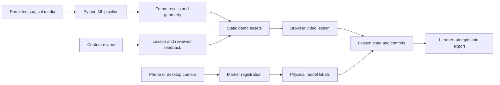

# Holospex architecture

Holospex is a browser-based surgical education prototype with two experiences: lessons over recorded surgical imagery, and labels registered to a physical anatomical model through a phone or desktop camera. The long-term direction is AR glasses for residents. This two-day build assumes simulated practice; assistance during operations on patients is an unresolved future scope, not an implemented capability.

This document defines boundaries for contributors. It describes the intended system; the existence of a folder or interface does not mean its feature is complete. See [the team plan](team-plan.md) for integration gates and [the root README](../README.md) for the scaffold's runnable commands.

## System boundaries

The recorded-lesson path uses precomputed results. The browser can start a
lesson without a GPU, an inference server, or completed model training.

The [identification client](live-feed.md) accepts a camera/USB capture stream,
an uploaded image or video, or a direct HTTPS video/HLS link and uses the built-in
`/api/identify` bridge to the trained Python checkpoint runner. It
displays each identification with its captured image and bounds encoding,
transit and inference to 6,000 ms from capture. Camera preview stays local;
**Capture & identify** copies and sends one displayed frame, then holds that
still with its matching result until **Retake** or a session reset. Hide/show
controls preserve the camera snapshot and do not send another request. Stopping
or replacing the camera, interruption, page visibility changes or refreshing
the model invalidate it. Applying a user-entered confidence cutoff also clears
the result and pending work; camera mode waits for another explicit capture.
Uploaded-image selection is also local: **Identify image** sends one resized
JPEG and holds the matching result on that still. Applying a cutoff keeps the
image, clears its result and waits for another explicit identification.
The selected percentage becomes a per-request `minimumConfidence` from 0 to 1
in the JPEG envelope, controlling both model pixel filtering and HUD visibility
without mutating the runner default. Readiness advertises support for this
input; older hosts keep their own default. The runner reuses Person 1's segmentation adapter;
weights and runtime hosting are supplied separately. Live identification has
no assessment controls, and marker registration stays independent.
Uploaded and linked video playback are separate from the lesson's precomputed
result path. They send sampled captured frames continuously to the model, expire
old results outside paused-frame inspection and invalidate pending results on
seek, source replacement or playback transitions. Capture dimensions
describe the resized image actually sent, preserving aspect ratio within
1280 x 720. Predictions and captured pixels share that coordinate system.
Stream links load directly in the browser with anonymous cross-origin access;
the host must permit media requests, including every HLS resource. HLS.js 1.7.3
loads on demand, with native HLS fallback where supported. The URL remains in
browser state and is excluded from model requests, application logs and saved
recordings. The model bridge receives the same sampled JPEG/frame contract;
it does not fetch source URLs or convert RTSP or provider watch pages.

The two imaging paths remain independent:

| Concern | Recorded surgical imagery | Physical anatomical model |
| --- | --- | --- |
| Input now | Selected images or recorded footage | Phone or desktop camera |
| Anatomy placement | Per-frame image geometry | Predefined locations relative to a registered marker/model |
| Processing | Reviewed annotations or surgical-image ML | Camera tracking and marker registration |
| Coordinate system | Original image pixels | Explicit marker/model coordinate system |
| Future glasses input | Laparoscope video feed for internal anatomy | Glasses' outward-facing camera |

**Contributor comment:** marker tracking locates a model; it does not recognize surgical anatomy. Share anatomy IDs, colors, and learning controls between modes, but do not pass marker poses through the surgical segmentation contract. The camera mode needs its own tracking adapter and declared units/origin before anyone builds against it.

## Repository boundaries and ownership

| Path | Owner | Responsibility |
| --- | --- | --- |
| `apps/web/` | Person 3, with Person 2 owning renderer and camera integration | React/TypeScript lesson UI, presentation, camera entry, attempts |
| `ml/` | Person 1: ML and architecture lead | Dataset mapping, preprocessing, inference, evaluation, export |
| `contracts/schemas/` | Person 1, coordinated with both consumers | Canonical JSON Schemas for exchanged records |
| `contracts/` | Person 1 | Generated TypeScript package `@holospex/contracts`, shared anatomy vocabulary |
| `assets/demo/` | Each owner supplies their assets; Person 1 coordinates | Source demo fixtures and permitted media |
| `docs/` | Shared | Integration decisions, limitations, team handoffs |

The root npm workspace coordinates the frontend and contracts package. The root asset preparation script copies `assets/demo/` to the browser's `public/demo/` directory. Edit the source assets, not their copied output. Python exports to the source assets location; it should not write into React components or generate application state.

Do not hand-edit generated TypeScript declarations. Change the canonical schema, regenerate the types, update the fixtures and both producers/consumers, and run the repository checks together. Agree on a contract change with the affected owner before merging independent work.

## Three shared records

Exact required fields and enum values live in [the schemas](../contracts/schemas/): [Lesson](../contracts/schemas/lesson.schema.json), [FrameResult](../contracts/schemas/frame-result.schema.json), and [LearnerAttempt](../contracts/schemas/learner-attempt.schema.json). Keep their responsibilities separate:

| Record | Meaning | Must not become |
| --- | --- | --- |
| `Lesson` | Media references, checkpoints, questions, content review metadata, reviewed answers and explanations | A model's claim that a CVS criterion is satisfied |
| `FrameResult` | One media/frame identity, timestamp, original dimensions, geometry, source, inference status and applicable confidence | A learner answer key or a marker/world pose |
| `LearnerAttempt` | One learner response, question/checkpoint identity, elapsed time and hint exposure | A prediction result or a record of technical failures as wrong answers |

Every record carries `schemaVersion`. Lesson questions carry `reviewedAnswer` with `choiceId`, `explanation`, and their own source, either `synthetic_mock` or `expert_reviewed`; expert review also requires `reviewerId`. These answer sources are deliberately different from overlay provenance. Attempts store `selectedChoiceId`; score it by looking up the lesson answer, never by reading an ML detection.

**Contributor comment:** model confidence is about an exported prediction. It is not the probability that a lesson answer is correct, nor a measure of whether a resident should proceed with a surgical action. The lesson owns feedback independently of the current overlay source.

Use the shared anatomy IDs and colors everywhere. The ML adapter must explicitly map dataset classes into those IDs, report unsupported classes, and invert resize/crop transforms before export. Do not guess that a generic segmentation checkpoint supports this procedure's anatomy.

## Geometry and synchronization

- Export `coordinateSpace: "original_pixels"` with the original `width` and `height`: origin at the upper-left, x to the right, y downward. `timestampMs` is milliseconds relative to the start of that media.
- Each structure instance initially uses one simple polygon contour. Coordinates describe continuous image edges, so valid bounds include `[0, width]` and `[0, height]`. This contract does not yet encode raster masks, polygon holes, or multi-contour instances. Do not silently discard holes during conversion; document the approximation or evolve the contract before depending on it.
- Scale geometry using the displayed image rectangle, including letterbox offsets. A CSS-sized video element can contain a smaller actual image; mapping directly to the element's full bounds creates misplaced labels.
- A result belongs to the specified media and frame/checkpoint. On seek, source change, loading, or playback away from that checkpoint, clear the overlay until the displayed frame is matched. Reject a late result from the previously selected media.
- Start with playback paused at explicitly selected, annotated checkpoints. Sparse reviewed annotations do not establish reviewed overlays for intervening frames. Do not silently stretch a checkpoint's geometry over continuous playback.
- If temporal propagation is later implemented, export new results tied to their target frames, mark them `propagated_prediction`, and retain their origin. Smoothing must not disguise missing evidence or stale results.
- Physical-model transforms need their own coordinate convention and registration quality state. Hide registered labels when tracking is lost; do not leave the last pose displayed as if it remains registered.

## Provenance and unavailable states

Always show the active overlay source. The supported provenance vocabulary distinguishes `synthetic_mock`, `reviewed_annotation`, `ml_prediction`, and `propagated_prediction`. A synthetic fixture proves integration only. A review flag describes provenance supplied by the content owner; schema validation cannot perform medical review or verify a license. Keep the asset's actual license and review record alongside the demo assets.

`FrameResult.status` is `ok`, `unsupported`, `missing`, or `error`. Every non-`ok` result must have empty `structures` and a `statusReason`. An `ok` result with empty `structures` is valid and means no detections were exported; it does not prove anatomical absence. Prediction sources carry a model ID/version and per-structure confidence. A propagated result also carries `propagatedFromTimestampMs`.

Keep these conditions separate in both code and UI:

| Condition | Required behavior |
| --- | --- |
| Successful inference with no detections | Render no anatomy; retain the successful result status |
| Missing result, unsupported input, or inference failure | Clear geometry and explain technical availability; do not score the learner against the failure |
| Prediction below the selected threshold | Withhold the affected prediction; do not convert that threshold into a CVS answer |
| Learner chooses `cannot_determine` | Store it as an answer and evaluate only against independently reviewed lesson content |
| Unknown/unreviewed lesson answer | Do not present correctness feedback as reviewed; keep content visibly provisional |
| Physical marker tracking lost | Clear registered labels and request reacquisition through the camera UI |

Prediction thresholds belong to the pipeline/configuration and should be documented with the export. Confidence is optional for reviewed geometry and must not be fabricated to make records look uniform.

## Browser flow and persistence

The lesson controller owns progression: instruction → answer with labels hidden → commit response → feedback → a different-case transfer assessment. Renderers receive media/results and explicit visibility controls; they do not decide correct answers or advance the lesson independently.

Start response timing when the checkpoint and question are ready for interaction. A response should retain whether hints were exposed, including if labels were shown and subsequently hidden. Camera/inference loading time should not accidentally become learner response time. Record one committed response once, even if a component rerenders.

For the hack, local attempt storage and JSON export are sufficient. Make the persistence mechanism and reset/export controls explicit in the interface. Browser-local state is device-specific and is not a durable study database. Do not add accounts, a hosted database, or cross-device synchronization until the lesson and camera demo work.

## Route to glasses

Keep adapters for image input, perception/registration, lesson logic, and display separate. A glasses implementation would replace camera/feed and display adapters while retaining compatible anatomy vocabulary and lesson content. It still requires device-specific tracking, interaction, calibration, performance measurement, and validation; browser interfaces do not establish hardware readiness.

The glasses' outward-facing camera and the laparoscope feed are separate sources. Displaying internal laparoscopic anatomy requires access to the surgical feed; room-camera footage does not supply that view. Defer surgical-feed ingestion and patient-use workflows until their product scope is explicitly defined.
